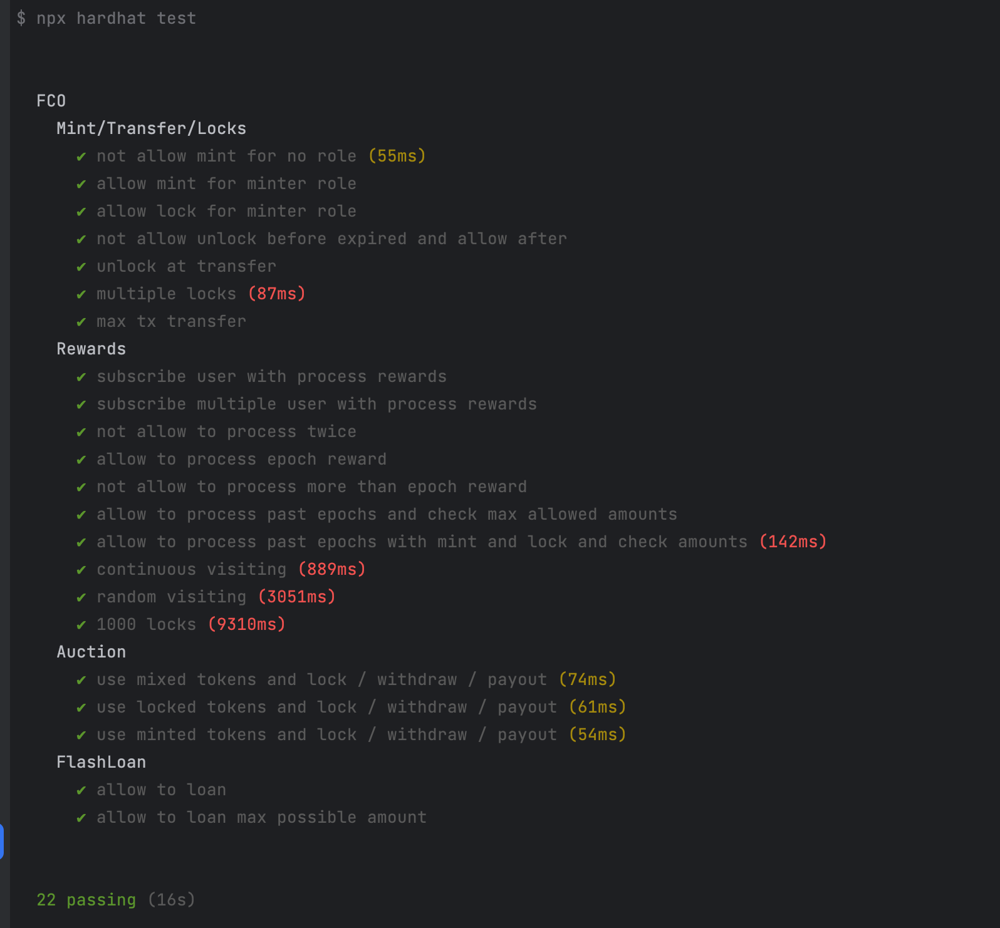

# FCO Smart Contracts

This repository contains the source code for Fanatico smart contracts (FCO) developed using the Hardhat framework. The contracts are written in Solidity, and they can be compiled, tested, and deployed using various Hardhat plugins.

## Table of Contents

- [Prerequisites](#prerequisites)
- [Installation](#installation)
- [Usage](#usage)
    - [Compile Contracts](#compile-contracts)
    - [Run Tests](#run-tests)
    - [Generate Coverage Report](#generate-coverage-report)
    - [Deploy Contracts](#deploy-contracts)
- [License](#license)

## Prerequisites

- [Node.js](https://nodejs.org) v12.x or later
- [NPM](https://www.npmjs.com/) v6.x or later or [Yarn](https://yarnpkg.com/) v1.22 or later
- [Hardhat](https://hardhat.org/) v2.14.0 or later

## Installation

1. Clone the repository:
    ```bash
    git clone https://github.com/virtulos/FCO.git
    ```
   
2. Install the dependencies:
`yarn install` or `npm install`

## Usage

### Compile Contracts

To compile the Solidity contracts, run the following command:

`yarn compile` or `npm run compile`

### Run Tests

To run the tests, run the following command:

`yarn test` or `npm test`




### Generate Coverage Report

To generate the code coverage report, run the following command:

`yarn coverage` or `npm run coverage`


### Deploy Contracts

To deploy the contracts to the BSC testnet network, run the following command:

`yarn deploy` or `npm run deploy`

> Note: make sure to set the `BSC_TESTNET_PRIVATE_KEY` environment variable to the private key of the account that will deploy the contracts.


## License

This project is licensed under the [MIT License](LICENSE).
